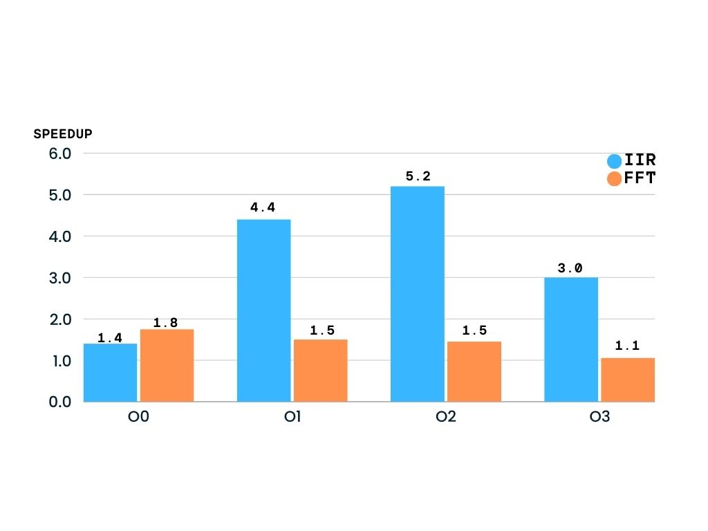

# SIMD equalizer #
### The data processed ###
We have a `.wav` file, the bit depth is 16, which means that each frame ("sample") is 16 bit, and the sample rate is 44100 Hz, meaning that each second we have 44100 samples. 
This configuration of bit depth + sample rate is the CD standard, usually musicians can record with a sample rate of 48000 (also more for advanced scenarios) and a bit depth of 24, but the CD standard is sufficient to 
listen to good quality music (streaming platforms use much lower quality).

To have more flexibility, we use the Fast Fourier Transform to have the audio in two arrays that represent complex numbers: the first array with the real part and the second with the imaginary part. This simplifies the operations needed to process audio. Each array is divided into N slices (N as the number of equalizer bands, in our case is three: low freq., mid and high), every value of the slice is multiplied by a gain that increases or decreases the volume of that specific band.

## FFT version ##
First, the pattern of the "naive" equalizer in C++ is something like this:
```
for (int i = 0; i < lowBandEnd; ++i) {
        real[i] *= lowGain;
        imag[i] *= lowGain;
    } // similar for mid and high
```

This is shown in the file ```ParallelEQ.cpp``` scalar function.
We can easily parallelize this problem:
```
for (int i = 0; i < lowBandEnd; i += 4) {
        // load of 4 values
        _mm_store_ps(&real[i], _mm_mul_ps(lowGain, _mm_load_ps(&real[i])));
        _mm_store_ps(&imag[i], _mm_mul_ps(lowGain, _mm_load_ps(&imag[i])));
    } 
```

At first, we had to deal with double-precision floating point numbers (64 bit each one), but this format was too large: if a single register is 128 bit, the theoretical speedup is only 2...
So, in this version, we used float (32 bit). The result, in terms of audio quality, is still high, so we can't hear the difference. 

## IIR version ##
IIR stands for *Infinite Impulse Response* and is an alternative method for signal processing. In our use-case is a very fast method to divide frequencies. The main advantage is that we can process the 16 bit sample directly, without the necessity to process complex numbers in floating point.
**But, the result is not as precise as the one we saw before.** The gain calculation and band division is more imprecise.
Even if it's not like the equalizer with the FFT, the IIR could be implemented with more advanced techniques and used for real-time applications.

For IIR this is the approach:
1. We divide each sample in three parts (LOW, MID, HIGH) quickly with IIR filter .
2. Each sample-slice is multiplied by the gain.

So we have three IIR filter: the first selects the low frequencies, the second for the mid and the third for the high frequencies. The mathematic formula to apply the filter is the same for the three filters, only some coefficients change: 


\
Where `x(n)` is the input sample, `y(n)` the filtered output and `a`,`b`,`z` the coefficients. There is a function called `applyIIRFilter()` that implements the formula.

In scalar mode, the code is:
```
		// First, separate bands by filtering
		int16_t low = applyIIRFilterSequential(samples[i], bLow, aLow, zLow);

		// Then apply gains to each separated band
		low = static_cast<int16_t>((static_cast<int32_t>(low) * lowGain) >> 16);
```

And the parallel function is similar:
```
        // Apply filters
        applyIIRFilterSIMD(&samples1_32, &low1_32, 4, bLow, aLow, zLow);
        
		// Apply gains with intermediate scaling
		low1_32=_mm_srai_epi32(_mm_mullo_epi32(low1_32,lowGain),FIXED_POINT_SCALE);
```

But, as introduced before, we have some **precision problems**:
- The formula needs the sample x[n] but also the previous samples x[n-1] and x[n-2], very sequential. We can adjust this by updating the values not every sample but every 4 samples (like a "point of sync") losing precision. The audio result is still ok.
- We can't deal directly with 16-bit sample but we need to upscale to 32 bit to handle overflow. The theoretical parallelism is 4 so is still ok.
- To remain in the integer domain, we use fixed-point scale (not very precise).

## Performances ##
The IIR version seems less sensible in terms of audio quality, and this is true, but with more advanced techniques and analysis is a very powerful implementation, mostly because **it's faster than FFT version**. The program is more efficient, and a lot of operations (due to Fourier Transform) are unnecessary in the IIR version.

After about 30 executions of every version (with all C++ optimization levels), these are the main considerations:

 - Speedup is way higher in IIR version (5x in O2 level!).
 - Total execution time is shorter in IIR version (about 8 times faster than FFT version).



### Conclusions ###
In conclusion, both the FFT-based and IIR-based equalizers have their advantages and trade-offs. The FFT-based approach provides high precision and better audio quality, making it ideal for situations where the utmost accuracy is required. It allows for detailed frequency division and manipulation, but comes with higher computational costs due to the complexity of the Fast Fourier Transform.

On the other hand, the IIR-based approach offers significant performance improvements, especially in terms of speed. The IIR filters can process audio more efficiently, with lower computational overhead, making it suitable for real-time applications. While the precision may not match the FFT approach, for many practical use cases, the trade-off in quality is negligible, especially when optimized for real-time processing.

Ultimately, the choice between these two methods depends on the specific requirements of the application:

-   If real-time performance and efficiency are crucial, the IIR-based equalizer is a better choice.
-   If maximum audio quality is the priority and computational resources are available, the FFT-based equalizer is the more suitable option.

Future improvements could focus on refining the IIR filter design to improve precision without sacrificing speed, or exploring hybrid approaches that combine the strengths of both methods.
